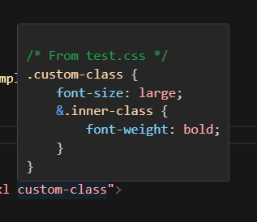
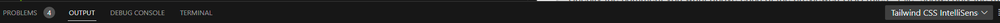
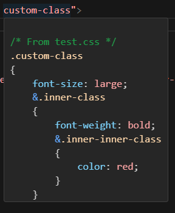

# Tailwind Layer Parser

[Installation](#installation)
[Usage](#usage)
[Configuration](#configuration)
[Extras](#extras)

---

**Layer Parser** lets you autocomplete and preview custom css while utilizing the benefits of TailwindCSS.

This is extremely useful for monorepos using similar styling across several projects. Your custom CSS can be organized in dedicated files to use a more familiar CSS language rather than specifying classes through tailwind's native JSON syntax.

---

## Installation

> **Warning**
> This is a plugin for TailwindCSS, and can only be used in a project using [TailwindCSS as a PostCSS plugin](https://tailwindcss.com/docs/installation/using-postcss).

```sh
npm i tailwind-layer-parser
```

```sh
yarn add tailwind-layer-parser
```

```sh
pnpm add tailwind-layer-parser
```

## Usage

> **Note**
> Only tested on VS Code, in a vite compiled vue project. However I don't see why it wouldn't work in other Tailwind environments.

1. First have CSS files you want to see with Tailwind intellisense.
```css
.custom-class {
    font-size: large;
    &.inner-class {
        font-weight: bold;
    } 
    &.inner-inner-class {
        color: red;
    }
}
```
2. Adjust your plugin list in your ```tailwind.config.js```

```js

const plugin = require("tailwindcss/plugin");
const { ParseCSSDirectoryPlugin } = require("tailwind-layer-parser"); // Import the helper function

/** @type {import('tailwindcss').Config} \*/
module.exports = {
    content: ["./index.html", "./src/**/\*.{js,ts,vue}"],
    theme: {
        extend: {},
    },
    plugins: [
        plugin(
            ParseCSSDirectoryPlugin({
                directory: `${__dirname}/css`
            });
        ),
    ],
};
```
3. If you have configured your target directory properly, your classes should now show up in your intellisense.
<div style="text-align:center"></div>

## Configuration
For those wanting to customize your experience...
> **Note**
> Typings for the configuration can be explored in your code editor as well.

> **Warning**
> Adjustments to CSS rules are for intellisense preview only, and do not modify the CSS in files.

> **Properties**
> ```ts
> directory: string
> ``` 
> The path to the directory of css files you want to parse.
> 
> ---
> ```ts
> unlayeredClassBehavior: "Ignore" | "Component" | "Utility"
> ```
> Determines what to do with classes that aren't located in @layer components {} or @layer utilities {}
> 
> Defaults to "Utility".
>
> ---
> ```ts
> globPatterns: string[]
> ```
> Customize the glob patterns used to match css files in the provided directory. Internally, the [glob](https://www.npmjs.com/package/glob) package is used; use their docs for reference on proper glob patterns.
> 
> Defaults to match all immediate and nested .css files ("**/*.css")
>
> ---
> ```ts
> debug: boolean
> ```
> Defaults to false.
> 
> Determines whether or not to provide additional details to console print-outs.
> 
> Currently, there are print-outs for the folowing:
> - ALWAYS - Count of the rules that were not added because unlayeredBehavior ignored them.
> - DEBUG - A list of the rules that were not added because unlayeredBehavior ignored them.
> - ALWAYS - Count of the duplicate selectors found in target directory
> - DEBUG - A list of duplicate selectors found in the target directory
> - ALWAYS - A list of file names that matched the glob patterns but did not end with ".css"
>
> Plugin output is located in the output terminal of VS Code, under "Tailwind CSS Intellisense."
> <div style="text-align:center"></div>
>
> ---
> ```ts
> commentType: "File" | "Absolute" | "None"
> ```
>  Specify the comment you want above each of the previewed CSS rules. "File" shows only the rule's containing file's name. "Absolute" shows the exact path of the containing file. "None" removes the comment from the preview.
>
> Defaults to "File".
>
> ---
> ```ts
> openBracketNewLine: boolean
> ```
> Defaults to false.
> 
> Basically Allman style for CSS rules when set to true.
> <div style="text-align:center"></div>

## Extras
There is an additonal export from the plugin: ```cssParser```. This is the underlying processor for globbing, parsing, modifying, and preparing the desired CSS. This export allows the adventurous developers to make their own tailwind plugin and do their own processing AFTER this plugin.

> **Note**
> The result of ```cssParser``` is an object. You can also view this type in your code editor.
> ```ts
> {
>   utilities: Node[],
>   components: Node[]
> }
> ```
> ```Node``` type comes from the ```PostCSS``` package.

For those who have their ```tailwind.config.js``` in a separate directory tree than the target css, trying something like this for your ```directory``` to find it:
```js
`${__dirname}/../css`
```