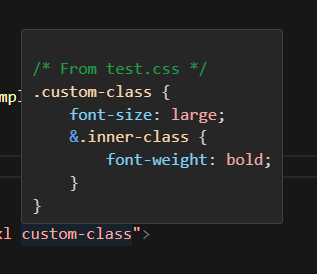
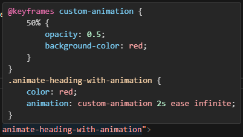
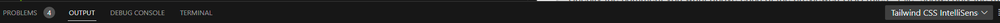
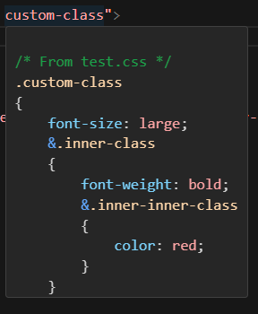

# Tailwind Layer Parser

[Installation](#installation)
[Usage](#usage)
[Configuration](#configuration)
[Extras](#extras)

---

**Layer Parser** lets you autocomplete and preview custom css while utilizing the benefits of TailwindCSS.

This is extremely useful for mono-repos using similar styling across several projects. Your custom CSS can be organized in dedicated files to use a more familiar CSS language rather than specifying classes through tailwind's native JSON syntax.

---

## Installation

> **Warning**
> This is a plugin for TailwindCSS, and can only be used in a project using [TailwindCSS as a PostCSS plugin](https://tailwindcss.com/docs/installation/using-postcss).
> Note, you should use Tailwind's intellisense plugin in order to see the benefits of this plugin.

```sh
npm i tailwind-layer-parser
```

```sh
yarn add tailwind-layer-parser
```

```sh
pnpm add tailwind-layer-parser
```

## Usage

> **Note**
> Only tested on VS Code, in a vite compiled vue project. However I don't see why it wouldn't work in other Tailwind environments.

1. First have CSS files you want to see with Tailwind intellisense.
```css
.custom-class {
    font-size: large;
    &.inner-class {
        font-weight: bold;
    } 
    &.inner-inner-class {
        color: red;
    }
} 

@keyframes custom-animation {
    50% {
        opacity: 0.5;
        background-color: red;
    }
}

.heading-with-animation {
    color: red;
    animation: custom-animation 2s ease infinite;
}

```
2. Adjust your plugin list in your ```tailwind.config.js```

```js
const plugin = require("tailwindcss/plugin");
const { ParseCSS } = require("tailwind-layer-parser");

/** @type {import('tailwindcss').Config} \*/
module.exports = {
    content: ["./index.html", "./src/**/\*.{js,ts,vue}"],
    theme: {
        extend: {},
        },
    plugins: [
        plugin(
            ParseCSS({
                directory: `${__dirname}/css`, // config object here
            })
        ),
    ],
};
```
3. If you have configured your target directory properly, your classes should now show up in your intellisense. This requires the TailwindCSS intellisense extension to be installed. Only tested in VS code.
<div style="display: flex; align-items: center; justify-content: center; gap: 5rem;">
    
    
</div>

## Configuration
For those wanting to customize your experience...
> **Note**
> Typings for the configuration can be explored in your code editor as well.
> Adjustments to CSS rules are for intellisense preview only, and do not modify the CSS in files.
>

> **Warning**
> You should not invoke the helper function more than once per ```tailwind.config.js```. Doing so will result in inaccuracies and may cause unexpected stylings.
>

> **Properties**
> ```ts
> directory: string
> ``` 
> The path to the directory of css files you want to parse.
> 
> ---
> ```ts
> unlayeredClassBehavior: "Ignore" | "Component" | "Utility"
> ```
> Determines what to do with classes that aren't located in @layer components {} or @layer utilities {}
>
> Utility means all styles not located in a layer are added as utilities.
> Components means all styles not located in a layer are added as components.
>
> Refer to tailwind documentation for the difference between components and utilities.
> 
> Defaults to "Utility".
>
> ---
> ```ts
> globPatterns: string[]
> ```
> Customize the glob patterns used to match css files in the provided directory. Internally, the [glob](https://www.npmjs.com/package/glob) package is used; use their docs for reference on proper glob patterns.
> 
> Defaults to match all immediate and nested .css files ("**/*.css")
>
> It is recommended to better utilize this setting than use additional ```ParseCSS``` invocations for parsing multiple directories. Multiple invocations of this method will cause inaccurate tracking of duplicate rules and will add them all to TailwindCSS. This will result in multiple stylings for the same class name. For some this may be a feature, but it generally means you have a messy style system.
>
> ---
> ```ts
> debug: boolean
> ```
> Defaults to false.
> 
> Determines whether or not to provide additional details to console print-outs.
> 
> Currently, there are print-outs for the folowing:
> - ALWAYS - Count of the rules that were not added because unlayeredBehavior ignored them.
> - DEBUG - A list of the rules that were not added because unlayeredBehavior ignored them.
> - ALWAYS - Count of the duplicate selectors found in target directory
> - DEBUG - A list of duplicate selectors found in the target directory
> - ALWAYS - A list of file names that matched the glob patterns but did not end with ".css"
>
> Plugin output is located in the output terminal of VS Code, under "Tailwind CSS Intellisense".
> <div style="text-align:center"></div>
>
> ---
> ```ts
> commentType: "File" | "Absolute" | "None"
> ```
>  Specify the comment you want above each of the previewed CSS rules. "File" shows only the rule's containing file's name. "Absolute" shows the exact path of the containing file. "None" removes the comment from the preview.
>
> Defaults to "File".
>
> ---
> 
> ```ts
> openBracketNewLine: boolean
> ```
> Defaults to false.
> 
> Basically Allman style for CSS rules when set to true.
> <div style="text-align:center"></div>
>
> ---
>
> ```ts
> animationPrefix: string
> ```
> Specify the prefix to use when adding your custom stylings that reference keyframes.
>
> Due to the way tailwind requires keyframes be *matched* to CSS styles, these utilities require a {prefix}-{suffix} notation. This setting defines the prefix. The suffix is the name of your class referencing the keyframe(s). Supports nested styles, and nested keyframes. However, such nested nodes will be *unwrapped* before tailwind shows you them in intellisense.
> 
> Defaults to "animate", and can not be blank.

## Extras
There are two additonal exports from this plugin. 

* ```cssParser``` is the underlying processor for globbing, parsing, modifying, and preparing the desired CSS. Also allows the adventurous developers to make their own tailwind plugin and do their own processing AFTER this plugin. 

* ```resetData``` is a utility function that clears the parsed components and utilities; the helper function calls this before each execution. 

By default ```cssParser``` internally stores all parsed components and utilities. Subsequent parses on different directories will be able to compare against selectors parsed by previous invocations. This generally helps to identify duplicate styles that may be unwanted.

> **Note**
> The result of ```cssParser``` is an object. You can also view this type in your code editor.
> ```ts
> {
>   utilities: Node[],
>   components: Node[]
> }
> ```
> ```Node``` type comes from the ```PostCSS``` package.

For those who have their ```tailwind.config.js``` in a separate directory tree than the target css, try something like this for your ```directory``` to find it:
```js
`${__dirname}/../css`
```